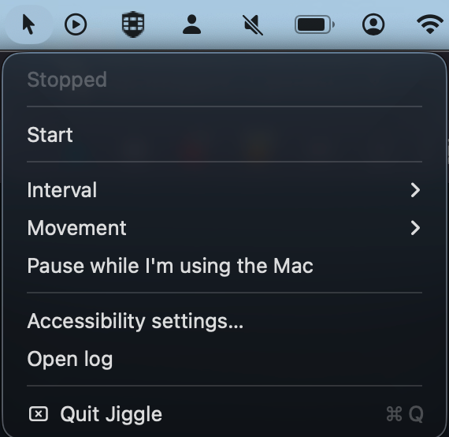

<p align="center">
  
</p>

# jiggle

Step away from the desk for ten minutes and something, somewhere, notes that you
were idle. This nudges the cursor now and then so that never happens — a small
random move, a smooth glide, back to the exact pixel it started from.

<p align="center">
  
</p>


> Want it without an app? [**jiggle-cli**](https://github.com/gorokhovdenis/jiggle-cli)
> is the same idea as a single bash script — one `curl`, no build, no bundle.

## What it does

A menu bar app in Swift, posting `CGEvent` directly. No dependencies at
runtime, nothing but Xcode Command Line Tools to build it.

- **Moves on a randomized schedule.** A fixed heartbeat every 60 seconds is
  itself a machine-shaped pattern; the pause is random within a range you pick.
- **Glides, and returns exactly.** Not a one-pixel teleport — a smooth arc out
  and back to the starting pixel, so nothing drifts over a long session.
- **Gets out of your way.** If the cursor is not where it was left, or a key was
  pressed in the last minute, someone is using the Mac and that cycle is skipped.
- **Resets `HIDIdleTime`** — the counter the OS and idle-aware software read.
  Measured, not assumed: `8749 ms` before a jiggle, `101 ms` after.
- **Verifies every move** by reading the cursor position afterwards, so
  "running" cannot quietly mean "nothing is happening" —
  [Accessibility permission](#accessibility-permission) explains why that
  failure mode is worth guarding against.

### Why another one

Because the usual suggestions did not work out here: of the jigglers tried,
several never got as far as showing a window, and one turned out to want paying.
Why each of them failed was never established — diagnosing someone else's
prebuilt binary is its own project.

So this is the other approach: a few hundred lines you can read in one sitting,
compiled on your own machine. If one of the established tools works for you,
use it; this exists because they did not.

## Install

### Download

1. Download `Jiggle-<version>.dmg` from the
   [latest release](https://github.com/gorokhovdenis/jiggle/releases/latest)
2. Open the disk image, drag `Jiggle.app` into `Applications`
3. Gatekeeper blocks the first launch, because the dmg is not notarized (that
   costs $99/year). Open it, dismiss the warning, then go to **System Settings →
   Privacy & Security**, scroll to *Security* and click **Open Anyway**. The
   Control-click → Open shortcut that older guides mention was removed in macOS
   Sequoia and no longer helps. From a terminal it is one command instead:
   ```sh
   xattr -dr com.apple.quarantine /Applications/Jiggle.app
   ```
4. Grant Accessibility when the app asks —
   [why it matters](#accessibility-permission)

Step 3 happens once. No Xcode is involved at any point.

### Build from source

Requires Xcode Command Line Tools (`xcode-select --install`) and macOS 13 or
later. git ships with the Command Line Tools, so there is nothing else.

```sh
git clone https://github.com/gorokhovdenis/jiggle.git
cd jiggle
./make-cert.sh      # once per machine, see Signing below
./build-app.sh      # builds ~/Applications/Jiggle.app
./make-dmg.sh       # optional: package it for another Mac
open ~/Applications/Jiggle.app
```

Prefer one file instead of a checkout — say, to hand the tool to someone over
mail or a messenger? `jiggle-installer.sh` from
[Releases](https://github.com/gorokhovdenis/jiggle/releases) is the repository
packed into a single self-extracting script: it asks where to unpack, mints the
certificate and builds the app in one go (`JIGGLE_BASE=~/code` or
`JIGGLE_DEST=~/tools/jig` skip the question). Regenerate it from a checkout
with `./make-installer.sh`.

## Usage

Click the menu bar icon to start and stop — no Dock icon, no window. The icon
carries the state: a plain cursor when stopped, a cursor with motion lines when
running, a warning triangle when events are going nowhere.

| Menu item | What it offers |
|---|---|
| **Interval** | 5–10 sec · 30–90 sec · 1–3 min · 3–8 min |
| **Movement** | subtle 4 px · normal 150 px · wide 400 px |
| **Pause while I'm using the Mac** | the skip described above |
| **Accessibility settings…** | opens the right pane directly |
| **Open log** | `~/Library/Logs/jiggle.log` |

Autostart: System Settings → General → Login Items → add Jiggle.

### If the icon is nowhere to be seen

Most likely a menu bar manager — Hidden Bar, Ice, Bartender — has put it in its
collapsed section, which works by moving icons off-screen. Expand it and
⌘-drag the Jiggle icon to the always-visible side of the separator.

If the menu bar genuinely has no room, Jiggle falls back to a Dock icon:
clicking starts and stops it, right-clicking opens the same menu.

## Accessibility permission

The cursor will not move without it, and this is the part that bites.

macOS decides which app a permission belongs to by the app's **designated
requirement**. With an ad-hoc signature — `codesign -s -`, what you get when
there is no certificate — that requirement is:

```
designated => cdhash H"fe68ba64..."
```

A hash of the binary itself. Rebuild the app and the hash changes, so the grant
stops applying — **silently**. The checkbox in System Settings stays on, the app
keeps counting moves, the cursor stands still. Nothing logs an error, because
`CGEvent.post` simply does nothing when unauthorized. Homebrew ships a dedicated
caveat about exactly this for unsigned formulae that need Accessibility, `yabai`
and `skhd` among them.

`make-cert.sh` creates a local self-signed certificate, which changes the
requirement to:

```
designated => identifier "com.gorokhovdenis.jiggle"
              and certificate root = H"ae47fa81..."
```

Tied to the identifier and the certificate rather than to the bytes of the
binary, so the grant survives any number of rebuilds. Run it once per machine.
It needs no admin rights and deliberately sets no trust settings: `codesign`
signs happily with an untrusted certificate, and TCC reads the designated
requirement, not the trust chain. The first `codesign` afterwards asks once for
access to the new private key — allow it and you will not be asked again.

Grant the permission from the app's **own** dialog on first launch. Adding
Jiggle by hand with "+" in System Settings looks equivalent and is not: such an
entry is dropped when the app restarts.

If a grant does break, reset it and relaunch:

```sh
tccutil reset Accessibility com.gorokhovdenis.jiggle
open -b com.gorokhovdenis.jiggle
```

## Signing: Gatekeeper vs TCC

Two things about signing are easy to conflate, and the difference is the whole
story here.

**Gatekeeper** validates the trust chain at launch. A self-signed certificate is
trusted only on the machine that made it, so on any Mac but the build machine
the downloaded app is rejected exactly as an ad-hoc one would be — hence the
one-time quarantine step for the dmg. Notarization is the only way to remove it.

**TCC** — the Accessibility grant — does *not* check trust. It only re-checks
the binary against the stored designated requirement described above, so every
update signed with the **same** certificate keeps the grant, even though that
certificate is untrusted on the target machine.

That is why the dmg ships an app signed with one stable certificate rather than
ad-hoc: the first launch costs a quarantine click regardless, but updates then
keep the permission. Releases must therefore all be built on the same machine —
the one holding that certificate's private key.

Building from source takes the other route: everything happens on the target
machine, where a locally built bundle never gets quarantined at all and
`make-cert.sh` mints that machine's own certificate. No download step, no
Gatekeeper, at the price of needing Xcode Command Line Tools.

Developer ID plus notarization is the only path with neither a build step nor a
quarantine click. That is what Hammerspoon, AltTab, Rectangle, Ice and
MonitorControl all do.

## Limitations

Worth being straight about:

- **This only affects the idle timer.** Software that tracks the foreground
  window, takes screenshots or logs keystrokes is unaffected by a moving cursor.
  If that is what you are up against, this tool will not help you.
- **Permissions do not transfer between machines.** They are per-machine TCC
  state, granted once per Mac, by hand.

## Uninstall

```sh
rm -rf /Applications/Jiggle.app ~/Applications/Jiggle.app
rm -f  ~/Library/Logs/jiggle.log
defaults delete com.gorokhovdenis.jiggle
tccutil reset Accessibility com.gorokhovdenis.jiggle
```

The signing certificate, if you made one, is in Keychain Access under
*Jiggle Local Signing*.

## License

[MIT](LICENSE)
